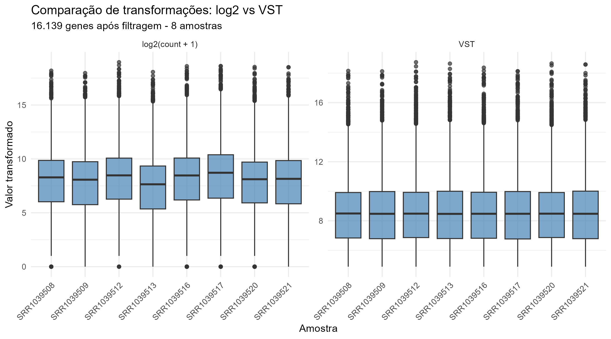
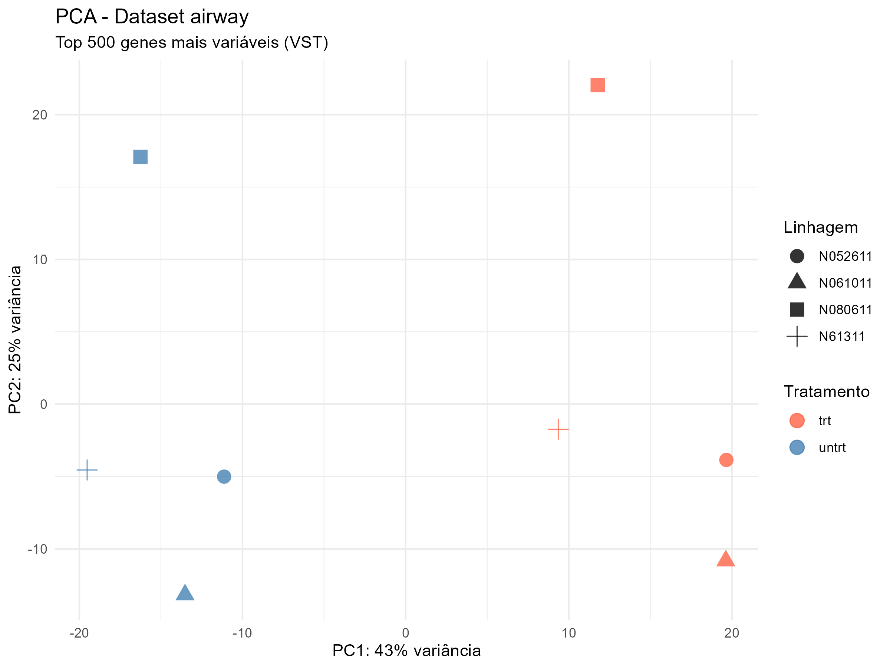
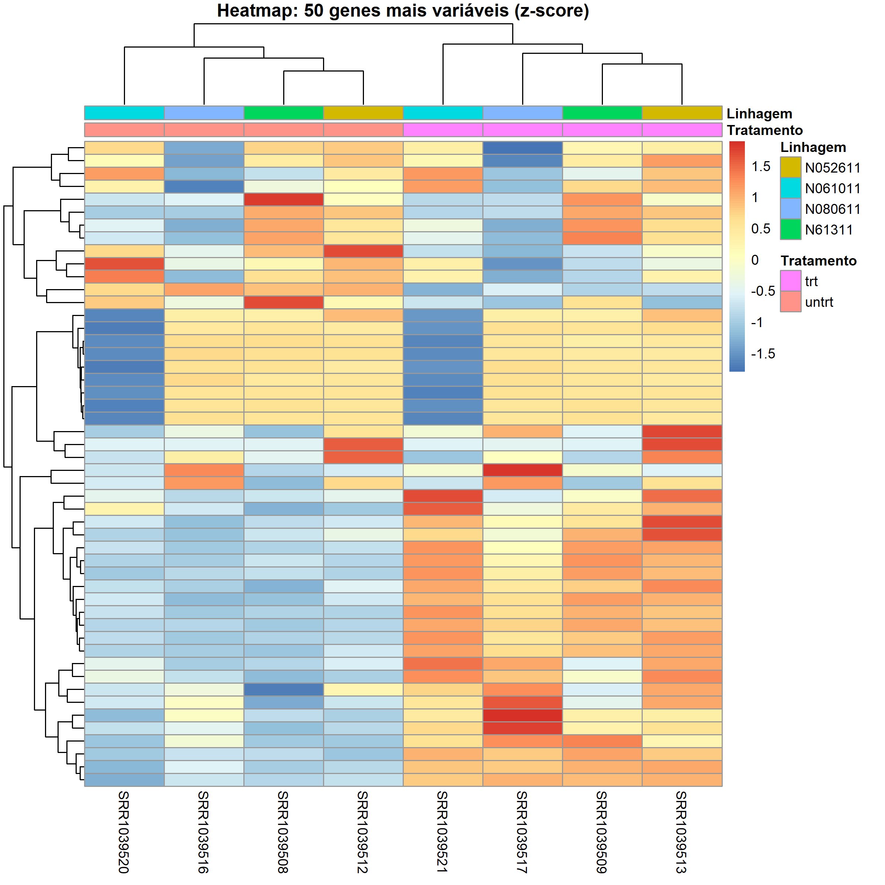

# Análise Exploratória do Dataset Airway

Análise exploratória de dados de RNA-seq do experimento Airway (Himes et al., 2014), investigando o efeito da **dexametasona** (corticoide) na expressão gênica de células de músculo liso de via aérea humana.

Projeto desenvolvido como parte do meu portfólio em bioinformática, com foco em análise de dados ômicos usando **R/Bioconductor**.

---

## Pergunta biológica

**As células de músculo liso de via aérea humana tratadas com dexametasona apresentam perfil de expressão gênica distinto das células controle?**

A dexametasona é um corticoide amplamente utilizado no tratamento de asma e doenças inflamatórias das vias aéreas. Compreender seus efeitos moleculares em células-alvo é fundamental para desenvolvimento de terapias mais específicas.

---

## Dataset

- **Fonte:** Pacote [`airway`](https://bioconductor.org/packages/airway/) (Bioconductor)
- **Tipo:** RNA-seq (Illumina)
- **Amostras:** 8 amostras
- **Desenho:** 4 doadores × 2 condições (tratado com dexametasona vs. controle), pareado
- **Genes anotados:** 63.677 (Ensembl)
- **Referência:** Himes BE, et al. *PLoS ONE* (2014). PMID: [24926665](https://pubmed.ncbi.nlm.nih.gov/24926665/)

| Doador | Controle (untrt) | Tratado (trt) |
|---|---|---|
| N61311 | SRR1039508 | SRR1039509 |
| N052611 | SRR1039512 | SRR1039513 |
| N080611 | SRR1039516 | SRR1039517 |
| N061011 | SRR1039520 | SRR1039521 |

---

## Metodologia

A análise seguiu o fluxo padrão de EDA (Análise Exploratória de Dados) em RNA-seq:

1. **Inspeção inicial** — estrutura do dataset, metadados das amostras
2. **Distribuição de contagens** — verificação de comparabilidade entre amostras (log2 transform)
3. **Filtragem** — remoção de genes com baixa expressão (critério: ≥10 contagens em ≥4 amostras)
4. **Transformação VST** — estabilização da variância para análises subsequentes (DESeq2)
5. **PCA** — investigação de agrupamento das amostras pelos top 500 genes mais variáveis
6. **Clustering hierárquico** — heatmap dos top 50 genes mais variáveis com anotações de tratamento e linhagem

### Stack técnica

- **R 4.6.0**
- **Bioconductor 3.23**: `airway`, `SummarizedExperiment`, `DESeq2`
- **CRAN**: `tidyverse`, `ggplot2`, `pheatmap`

---

## Resultados

### 1. Distribuição de contagens é comparável entre amostras

A transformação VST (Variance Stabilizing Transformation) estabilizou a variância dos dados, eliminando a dependência média-variância típica de dados de contagem. As 8 amostras apresentam distribuições consistentes, sem outliers técnicos.



### 2. Filtragem reduziu de 63.677 para 16.139 genes

- **47%** dos genes anotados não apresentam contagens detectáveis em nenhuma amostra (esperado para genes específicos de outros tecidos)
- Após filtragem rigorosa, **16.139 genes** (~25% do total) foram mantidos para análises subsequentes

### 3. PCA: tratamento separa amostras em PC1

O componente principal de maior variância (PC1, 43%) **separa cleanmente as amostras controle (esquerda) das tratadas (direita)**. PC2 (25% da variância) captura variabilidade entre doadores, mas em magnitude menor que o efeito do tratamento.



**Conclusão:** o efeito da dexametasona é o fator dominante de variação no experimento, superior à variabilidade interindividual entre doadores.

### 4. Clustering hierárquico confirma agrupamento por tratamento

O dendrograma do heatmap separa 100% das amostras pelo tratamento (4 controle de um lado, 4 tratadas do outro). Os 50 genes mais variáveis dividem-se em duas assinaturas opostas: **induzidos** e **reprimidos** pela dexametasona.



---

## Conclusões biológicas

1. **A dexametasona modula consistentemente a expressão gênica** em células de músculo liso de via aérea humana, com efeito detectável em todos os doadores.

2. **O efeito é robusto e reprodutível** — supera a variabilidade interindividual, o que sustenta o uso clínico amplo do composto.

3. **Há duas assinaturas opostas** de resposta: genes induzidos e genes reprimidos pelo tratamento, sugerindo regulação coordenada de vias biológicas distintas.

4. **O desenho pareado do experimento** (mesmo doador em ambas as condições) é apropriado e permite controlar variabilidade entre indivíduos.

---

## Limitações

- **Tamanho amostral pequeno** (n=8) limita poder estatístico para análises mais refinadas
- **Dataset didático** — efeito biológico forte e "limpo", não representativo da complexidade de dados clínicos reais (batch effects, confounders, ruído técnico)
- **Análise restrita a EDA** — não inclui expressão diferencial formal (DESeq2 com modelo `~ cell + dex`) nem enriquecimento funcional (GO/KEGG), que seriam próximos passos lógicos
- **Sem validação experimental** dos genes identificados (escopo de análise computacional)

---

## Como reproduzir

### Pré-requisitos

- R ≥ 4.4 (testado em 4.6.0)
- RStudio (recomendado)
- Bioconductor (instalado via `BiocManager`)

### Passos

```r
# 1. Clone o repositório
# git clone git@github.com:e-humberto/airway-eda.git
# cd airway-eda

# 2. Instale pacotes necessários (se ainda não tem)
install.packages(c("tidyverse", "pheatmap", "BiocManager"))
BiocManager::install(c("airway", "SummarizedExperiment", "DESeq2"))

# 3. Abra o projeto no RStudio
# File > Open Project > airway-eda.Rproj

# 4. Execute os scripts na ordem
source("R/01_setup.R")
source("R/02_eda.R")
source("R/03_export_figures.R")
```

As figuras serão geradas em `figures/`.

---

## Estrutura do projeto

```
airway-eda/
├── R/                        # Scripts de análise
│   ├── 01_setup.R           # Carrega pacotes e dataset
│   ├── 02_eda.R             # Análise exploratória (5 blocos)
│   └── 03_export_figures.R  # Exporta figuras em alta resolução
├── figures/                  # Figuras finais (PNG, 300 dpi)
├── data/                     # Dados (carregados via Bioconductor)
├── reports/                  # Relatórios (a expandir)
├── README.md
├── .gitignore
└── airway-eda.Rproj
```

---

## Referências

- Himes BE, et al. RNA-Seq Transcriptome Profiling Identifies CRISPLD2 as a Glucocorticoid Responsive Gene that Modulates Cytokine Function in Airway Smooth Muscle Cells. *PLoS ONE* 9(6): e99625 (2014). [DOI: 10.1371/journal.pone.0099625](https://doi.org/10.1371/journal.pone.0099625)
- Love MI, Huber W, Anders S. Moderated estimation of fold change and dispersion for RNA-seq data with DESeq2. *Genome Biology* 15:550 (2014).
- Pacote `airway`: [bioconductor.org/packages/airway](https://bioconductor.org/packages/airway/)

---

## Autor

**Emmanuel Humberto**
Bacharel e Licenciado em Ciências Biológicas | Pós-graduado em Bioquímica, Bioestatística e Bioinformática Aplicada à Saúde (PUC)

[LinkedIn](https://www.linkedin.com/in/emmanuel-humberto-carvalho-costa-9659b330) | [GitHub](https://github.com/e-humberto)